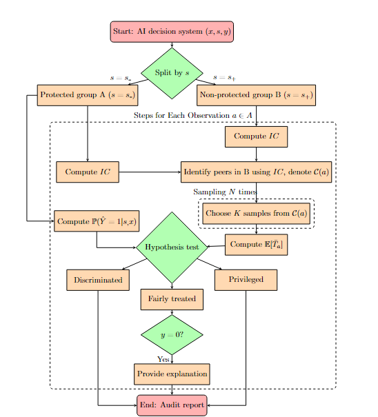

# Peer-Induced Fairness Framework for Algorithmic Bias Auditing

## Aim

This project aims to establish a robust and scientifically grounded fairness auditing framework that adheres to the regulatory requirements of the EU AI Act. The proposed framework, known as *peer-induced fairness*, utilizes the concept of peer comparison by quantitatively identifying similar peers through $IC$ and comparing their algorithmic treatments.

Our framework is a credible, stable, and universal tool that effectively addresses data scarcity and imbalance issues. It also provides transparent explanations for individuals who, despite being treated fairly by the algorithm, are still rejected.

Given its effectiveness and strength, this framework can serve as both an external auditing tool for regulators and third-party auditors, as well as an internal auditing tool for stakeholders.

> **For a detailed discussion of the theoretical foundation and methodology, please refer to our related paper: [*Peer-induced Fairness: A Causal Approach to Reveal Algorithmic Unfairness in Credit Approval*](https://arxiv.org/abs/2408.02558) (Fang, Chen, & Ansell, 2024).**

## Auditing Workflow

## Package Overview

This project comprises several key packages:

- **datasets**: Contains the datasets required for our empirical analysis, along with the selected features.

> Our framework is validated using data on loan application behaviors of SMEs when interacting with banks. The data, sourced from the UK Data Archive and the SME Finance Monitor, spans the period from 2012 to 2020 and includes 4,500 labeled records.
[UK Archive and the SME Finance Monitor](https://beta.ukdataservice.ac.uk/datacatalogue/studies/study?id=6888)
> - **Target Variable (Y):** The final outcomes of accessing finance serve as the target label for constructing our predictive model.
> - **Features (X):** We have selected 19 variables that are historically significant in the context of SME loans and available in our dataset. After filtering out features with a high missing ratio, 15 features were retained for prediction.
> - **Sensitive Attribute (S):** Firm size, categorized into micro firms and non-micro firms.
- **preprocess**: Includes preprocessing steps such as imputation, encoding, and other data cleaning processes. It is specific for our dataset.
- **auditing**: Includes the main analysis methods, such as model training, prediction, evaluation, sampling, ect.
- **example**: Includes the main experiment demonstrating the framework.
- **fig**: We put our visualisation results there.

## Conclusion

This analysis reveal the effectiveness of our peer-induced fairness auditing framework and the challenging banking environment. 

## Tools and Version

This project is built on Python 3.10.9.
